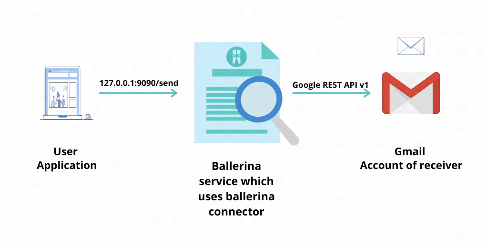

# Ballerina Gmail Connector

[](https://travis-ci.org/ballerina-platform/module-ballerinax-googleapis.gmail)
[](https://github.com/ballerina-platform/module-ballerinax-googleapis.gmail/commits/master)
[](https://opensource.org/licenses/Apache-2.0)

Connects to Gmail from Ballerina.

- [Gmail Connector](#Ballerina-Gmail-Connector)
    - [Introduction](#introduction)
        - [What is Gmail](#what-is-gmail-?)
        - [Key features of Gmail](#key-features-of-gmail)
        - [Connector Overview](#connector-overview)
    - [Prerequisites](#prerequisites)
    - [Supported versions & limitations](#supported-versions-&-limitations)
    - [Quickstarts](#quickstarts)
    - [Samples](#samples)
    - [Listener](#listener)
    - [Building from the Source](#building-from-the-source)
    - [Contributing to Ballerina](#contributing-to-ballerina)
    - [Code of Conduct](#code-of-conduct)
    - [Useful Links](#useful-links)

# Introduction

## What is Gmail?
[Gmail](https://blog.google/products/gmail/), short for Google Mail is a free email service developed by Google LLC. It
enables users to send and receive emails over the Internet. They provide several gigabytes of email data for the users
of the service. Google's mail servers provide several capabilities for the users free of charge including filtering of
spam mail and malware detection. Gmail like any other email service available, provides capability to send and receive 
emails, block spam, create an address book, and perform other basic email tasks. Google provides the Gmail SMTP server 
as a free SMTP service.

## Key Features of Gmail

- Gmail Filters. Allows you to organize the inbox which makes it easier to sort through.
- Spam/Junk mail filtering. Most spam is automatically sent to a separate spam folder, and after 30 days it is deleted.
- Conversation View. Gmail groups emails which sent about a specific topic or event together by default, which keeps 
your inbox more organized. 
- Smart Compose and Smart Reply.
- Assistive writing suggestions.
- Intelligent search suggestions.
- Advanced Search & Search Operators.         
- Built-in chat. Instead of sending emails, send someone an instant message or use the voice and video chat feature.
- Call Phone. Allows you to dial an actual phone number to call any phone in the world. 

and so much more.



## Connector Overview

Ballerina Gmail Connector provides the capability to send, read and delete emails through the Gmail REST API which 
allows to view and manage Gmail mailbox data like threads, messages, and labels. It also provides the ability to
get the Gmail profile and mailbox history, etc. Specifically, the connector uses the Gmail REST API version V1 
underneath it's implementation. Gmail uses OAuth 2.0 to authenticate and authorize requests. The Gmail connector can be 
minimally instantiated in the Gmail client config using the Access Token or by using the Client ID, Client Secret and 
Refresh Token.

# Prerequisites

* A Gmail Account with access <br/> https://support.google.com/mail/answer/56256?hl=en

* New project with `Gmail API` enabled on the API Console. If you want to use **`Listener`**, then enable `Cloud Pub/Sub API` or you can setup a service account with pubsub admin role and use it in configurations.
    - Visit [Google API Console](https://console.developers.google.com), click **Create Project**, and follow the wizard 
    to create a new project.

* OAuth Credentials 
    - Go to **Credentials -> OAuth Consent Screen**, enter a product name to be shown to users, and click **Save**.
    - On the **Credentials** tab, click **Create Credentials** and select **OAuth Client ID**.
    - Select the **Web application** application type, enter a name for the application, and specify a redirect URI 
    (enter https://developers.google.com/oauthplayground if you want to use [OAuth 2.0 Playground](https://developers.google.com/oauthplayground) 
    to receive the Authorization Code and obtain the Access Token and Refresh Token).
    - Click **Create**. Your Client ID and Client Secret will appear.
    - In a separate browser window or tab, visit [OAuth 2.0 Playground](https://developers.google.com/oauthplayground). 
    Click on the `OAuth 2.0 Configuration` icon in the top right corner and click on `Use your own OAuth credentials` and 
    provide your `OAuth Client ID` and `OAuth Client Secret`.
    - Select the required Gmail API scopes from the list of APIs.
    - If you want to use **`Listener`**, then select `https://www.googleapis.com/auth/pubsub` scope of `Cloud Pub/Sub API v1` too.
    - Then click **Authorize APIs**.
    - When you receive your authorization code, click **Exchange authorization code for tokens** to obtain the refresh 
    token and access token.

* If you prefer to use service account in listener authorization. [Create a service account](https://developers.google.com/identity/protocols/oauth2/service-account#creatinganaccount) with pubsub admin role and use the p12 key credentials.

* Java 11 Installed <br/> Java Development Kit (JDK) with version 11 is required.

* Ballerina SLBeta3 Installed <br/> Ballerina Swan Lake Beta 3 is required.

# Supported Versions & Limitations

## Supported Versions

|                                   | Version               |
|-----------------------------------|-----------------------|
| Gmail API Version                 | v1                    |
| Google Cloud Pub/Sub API Version  | v1                    |
| Ballerina Language                | Swan Lake Beta 3      |
| Java Development Kit (JDK)        | 11                    |

# Limitations
* Connector does not support several operations exposed by the Gmail API related to account settings.
* Supports only **OAuth authorization code flow** for authentication.

# Quickstart(s)

## Send a text message
### Step 1: Import the Gmail module
First, import the `ballerinax/googleapis.gmail` module into the Ballerina project.
```ballerina
import ballerinax/googleapis.gmail;
```


### Step 2: Initialize the Gmail Client giving necessary credentials
You can now enter the credentials in the Gmail client config.
```ballerina
gmail:GmailConfiguration gmailConfig = {
    oauthClientConfig: {
        refreshUrl: gmail:REFRESH_URL,
        refreshToken: <REFRESH_TOKEN>,
        clientId: <CLIENT_ID>,
        clientSecret: <CLIENT_SECRET>
    }
};

gmail:Client gmailClient = new (gmailConfig);
```
Note: Must specify the **Refresh token**, obtained with exchanging the authorization code, the **Client ID** and the 
**Client Secret** obtained in the App creation, when configuring the gmail connector client.


### Step 3: Set up all the data required to send the message
The `sendMessage` remote function sends an email. `MessageRequest` object which contains all the data is required
to send an email. The `userId` represents the authenticated user and can be a Gmail address or ‘me’ 
(the currently authenticated user).

```ballerina
string userId = "me";
gmail:MessageRequest messageRequest = {
    recipient : "aa@gmail.com",
    sender : "bb@gmail.com",
    cc : "cc@gmail.com",
    subject : "Email-Subject",
    messageBody : "Email Message Body Text",
    // Set the content type of the mail as TEXT_PLAIN or TEXT_HTML.
    contentType : gmail:TEXT_PLAIN
};
```

### Step 4: Send the message
The response from `sendMessage` is either a Message record or an `error` (if sending the message was unsuccessful).

```ballerina
//Send the message.
gmail:Message|error sendMessageResponse = checkpanic gmailClient->sendMessage(messageRequest, userId = userId);

if (sendMessageResponse is gmail:Message) {
    // If successful, print the message ID and thread ID.
    log:printInfo("Sent Message ID: "+ sendMessageResponse.id);
    log:printInfo("Sent Thread ID: "+ sendMessageResponse.threadId);
} else {
    // If unsuccessful, print the error returned.
    log:printError(sendMessageResponse.message());
}
```

## Management of messages in the Gmail account
### Step 1: Read a message which is available in the Gmail account
The `readMessage` remote function reads messages. It returns the `Message` object when successful or an `error` 
when unsuccessful.

```ballerina
gmail:Message|error response = gmailClient->readMessage(<@untainted>messageId);

if (response is gmail:Message) {
    io:println("Sent Message: " + response.toString());
} else {
    io:println("Error: ", response);
}
```

### Step 2: Trash the unwanted message
Trashing sends the message to the trash folder. The message does not delete permanently. The user can always un-trash 
the message before it automatically deletes by Gmail after 30 days. The operation returns `Message` record if the message
is trashed successfully. Else returns an `error`.

```ballerina
gmail:Message|error trash = gmailClient->trashMessage(sentMessageId);

if (trash is gmail:Message) {
    log:printInfo("Successfully trashed the message");
} else {
    log:printError("Failed to trash the message");
}
```

### Step 3: Permanently delete the unwanted message
The `deleteMessage` remote function deletes messages permanently from the Gmail account. It returns an `error` when 
unsuccessful.

```ballerina    
var delete = gmailClient->deleteMessage(<@untainted>messageId);

if (delete is error) {
    io:println("Error: ", delete);
} else {
    io:println("Message deletion success!");
}
```

# Samples
## Messages/Emails
Message in a Gmail account represents a single email. With the Gmail API, you can only create and delete messages, and 
apply labels to them, all other data is immutable and can’t be changed. The `ballerinax/googleapis.gmail` module 
contains operations to send emails in Text and HTML formats with attachments and inline images. It supports searching 
and reading emails in Gmail using Gmail filters. The module also supports trashing, un-trashing, deleting, and modifying 
emails.

### Send a message containing text payload
This sample shows how to send a simple email that contain only text content to a specific recipient. The necessary data 
to create an email in this connector is represented in a type called `MessageRequest`. User can decide what to send as 
data for an email. As the content type is text, the user must specify the `contentType` in `MessageRequest` as 
**text/plain**. This operation returns a Message record of the newly sent email. Else an `error`

```ballerina
// The user's email address. The special value **me** can be used to indicate the authenticated user.
string userId = "me";
gmail:MessageRequest messageRequest = {
    recipient : os:getEnv("RECIPIENT"), // Recipient's email address
    sender : os:getEnv("SENDER"), // Sender's email address
    cc : os:getEnv("CC"), // Email address to carbon copy
    subject : "Email-Subject",
    messageBody : "Email Message Body Text",
    // Set the content type of the mail as TEXT_PLAIN or TEXT_HTML.
    contentType : gmail:TEXT_PLAIN
};

gmail:Message|error sendMessageResponse = checkpanic gmailClient->sendMessage(messageRequest, userId = userId );

if (sendMessageResponse is gmail:Message) {
    // If successful, print the message ID and thread ID.
    log:printInfo("Sent Message ID: "+ sendMessageResponse.id);
    log:printInfo("Sent Thread ID: "+ sendMessageResponse.threadId);
} else {
    // If unsuccessful, print the error returned.
    log:printError(sendMessageResponse.message());
}
```
Sample is available at: https://github.com/ballerina-platform/module-ballerinax-googleapis.gmail/blob/master/samples/messages/send_text_message.bal

### Send a message containing html payload
This sample shows how to send a simple email that contain an html page as the payload to a specific recipient. The 
necessary data to create an email in this connector is represented in a type called `MessageRequest`. User can decide 
what to send as data for an email. As the content type is HTML, the user must specify the `contentType` in 
`MessageRequest` as **text/html**. This operation returns a Message record of the newly sent email. Else an `error`

```ballerina

string inlineImageName = "test_image.png";
string htmlBody = "<h1> Email Test HTML Body </h1> <br/> ";
gmail:MessageRequest messageRequest = {
    recipient : os:getEnv("RECIPIENT"), // Recipient's email address
    sender : os:getEnv("SENDER"),// Sender's email address
    cc : os:getEnv("CC"), // Email address to carbon copy,
    subject : "HTML-Email-Subject",
    //---Set HTML Body---    
    messageBody : htmlBody,
    contentType : gmail:TEXT_HTML
};

gmail:Message|error sendMessageResponse = gmailClient->sendMessage(messageRequest);
if (sendMessageResponse is gmail:Message) {
    // If successful, print the message ID and thread ID.
    log:printInfo("Sent Message ID: " + sendMessageResponse.id);
    log:printInfo("Sent Thread ID: " + sendMessageResponse.threadId);
} else {
    // If unsuccessful, print the error returned.
    log:printError("Error: ", 'error = sendMessageResponse);
}
```

Note: There are several other additional features provided by this send email functionality.
- Append Inline images

```ballerina
string inlineImagePath = "../resources/test_image.png";
string inlineImageName = "test_image.png";
string imageContentType = "image/png";

// Set Inline Images if exists
gmail:InlineImagePath[] inlineImages = [{imagePath: inlineImagePath, mimeType: imageContentType}];
messageRequest.inlineImagePaths = inlineImages;
```
- Append attachments
```ballerina
string testAttachmentPath = "../resources/test_document.txt";
string attachmentContentType = "text/plain";

// Set Attachments if exists
gmail:AttachmentPath[] attachments = [{attachmentPath: testAttachmentPath, mimeType: attachmentContentType}];
messageRequest.attachmentPaths = attachments;
```
Sample is available at: https://github.com/ballerina-platform/module-ballerinax-googleapis.gmail/blob/master/samples/messages/send_html_message.bal

### Read message
This sample shows how to read an email that is available in the authorized user's account. For this, the ID of the 
authorized user and the specific ID of an email which is available in that Gmail account should be provided as parameters.
This operation will return a `Message` if successful. Else return an `error`.

```ballerina


// ID of the message to read.
string sentMessageId = "<MESSAGE_ID>"; 

gmail:Message|error response = gmailClient->readMessage(sentMessageId);

if (response is gmail:Message) {
    log:printInfo("Is message details available: ", status = response.id == sentMessageId);
} else {
    log:printError("Failed to read message");
}
```
Sample is available at: https://github.com/ballerina-platform/module-ballerinax-googleapis.gmail/blob/master/samples/messages/read_text_message.bal

### Read a message which contain an attachment
This sample shows how to read an email that is available in the authorized user's account. Specifically, this email 
contains attachments which we can extract from it. So that we can extract the ID of that attachment from it. 
For this, the ID of the authorized user and the specific ID of an email which is available in that Gmail account should 
be provided as parameters. This operation will return a `Message` if successful. Else return an `error`. But, the focus
of this operation is extracting the attachment and that can be accessed inside the `MessageBodyPart` returned.

```ballerina

// ID of the message to read
string sentMessageId = "<MESSAGE_ID>";

gmail:Message|error response = gmailClient->readMessage(sentMessageId);

if (response is gmail:Message) {
   if (response?.msgAttachments is gmail:MessageBodyPart[] ) {
        log:printInfo("Attachment retrieved " + (<gmail:MessageBodyPart[]>response?.msgAttachments).toStrin());
   } else {
        log:printError("No attachment exists for this message");
   }
} else {
    log:printError("Failed to get attachments");
}

```
Sample is available at: https://github.com/ballerina-platform/module-ballerinax-googleapis.gmail/blob/master/samples/messages/read_message_with_attachments.bal

### Get attachment
This sample shows how to read an attachment that is available in the authorized user's account.Similar to above sample, 
we can to obtain the attachment itself using this operation. It will return only a `MessageBodyPart` as the response if
successful. Else returns `error`. 

```ballerina


// ID of the message where attachment belongs to.
string sentMessageId = "<MESSAGE_ID>"; 

// ID of the attachment
string readAttachmentFileId = "<ATTACHMENT_ID>";

gmail:MessageBodyPart|error response = gmailClient->getAttachment(sentMessageId, readAttachmentFileId);

if (response is gmail:MessageBodyPart) {
    log:printInfo("Attachment " + response.toString());
} else {
    log:printError("Failed to get the attachments : "+ response.message());
}

```
Sample is available at: https://github.com/ballerina-platform/module-ballerinax-googleapis.gmail/blob/master/samples/messages/get_attachment.bal

### Trash or un-trash message
This sample shows how to trash or un-trash an email that is available in the authorized user's account. When you trash a 
message, it stays in your Trash folder for 30 days. After that time, it will be permanently deleted. So if you want to 
recover the email you have deleted within these 30 days, you can do so using the un-trash capability of the connector. 
These two operations returns `Message` record if the operations are successful. Else returns `error`.

```ballerina 
// Moves the specified message to the trash.


// ID of the message to trash or un-trash.
string sentMessageId = "<MESSAGE_ID>"; 

gmail:Message|error trash = gmailClient->trashMessage(sentMessageId);

if (trash is gmail:Message) {
    log:printInfo("Successfully trashed the message");
} else {
    log:printError("Failed to trash the message");
}

gmail:Message|error untrash = gmailClient->untrashMessage(sentMessageId);

if (untrash is gmail:Message) {
    log:printInfo("Successfully un-trashed the message");
} else {
    log:printError("Failed to un-trash the message");
} 
```
Sample for trashing is available at: https://github.com/ballerina-platform/module-ballerinax-googleapis.gmail/blob/master/samples/messages/trash_message.bal <br/>
Sample is un-trashing is available at: https://github.com/ballerina-platform/module-ballerinax-googleapis.gmail/blob/master/samples/messages/untrash_message.bal

### Delete message
This sample shows how to delete an email that is available in the authorized user's account.In contrast to trashing a 
message, delete message permanently deletes the message such that it cannot be recovered again. This operation returns 
nothing if successful. Else returns `error`.

```ballerina


// Id of the message to delete. This can be obtained from the response of create message.
string sentMessageId = "<MESSAGE_ID>"; 

error? delete = gmailClient->deleteMessage(sentMessageId);
    
if (delete is error) {
    log:printError("Failed to delete the message");
} else {
    log:printInfo("Successfully deleted the message");
}
```
Sample is available at: https://github.com/ballerina-platform/module-ballerinax-googleapis.gmail/blob/master/samples/messages/delete_message.bal

## Working with Threads
A thread is a collection of messages that represents a conversation. Gmail creates threads automatically as users send 
and receive emails. With the Gmail API, you can delete threads and insert messages into existing threads. The 
`ballerinax/googleapis.gmail` module contains operations to read, search, trash, un-trash, modify and delete 
email threads in Gmail. Unlike messages, threads cannot be created, only deleted. Messages can, however, be inserted 
into a thread.

### Read a thread
This sample shows how to retrieve all data about a single thread present in the authorized user's account. This allows 
you to retrieve all messages in a conversation, in order, making it easier to have context for a message or to refine 
search result. For this operation in the connector, you must also provide the **ID of the thread** you want to read the 
information. Returns a `MailThread` if successful. Else returns `error`.

```ballerina

// ID of the thread to read.
string sentMessageThreadId = "<THREAD_ID";

// When given and format is METADATA, only include headers specified. Here, it will specify "Subject"
gmail:MailThread|error thread = gmailClient->readThread(sentMessageThreadId, format = gmail:FORMAT_METADATA, 
    metadataHeaders = ["Subject"]);
    
if (thread is gmail:MailThread) {
    log:printInfo("Thread obtained: ", status = thread.id == sentTextMessageThreadId);
} else {
    log:printInfo("Failed to get thread");
}
```
Sample is available at: https://github.com/ballerina-platform/module-ballerinax-googleapis.gmail/blob/master/samples/threads/read_one_thread.bal

### Modify a thread
This sample shows how to modify a single thread present in the authorized user's account. The ballerina connector only 
provide the capability to modify (add/remove) labels to a specific thread. For this operation in the connector, you must 
also provide the **ID of the thread** you want to read the information and **arrays of labels** you want to add or remove 
from the thread. Returns `MailThread` if successful. Else returns `error`.

```ballerina

// ID of the thread to modify.
string sentMessageThreadId = "<THREAD_ID"; 

// Modify labels of the thread with thread id which was sent in testSendTextMessage

log:printInfo("Add labels to a thread");
gmail:MailThread|error response = gmailClient->modifyThread(sentMessageThreadId, ["INBOX"], []);

if (response is gmail:MailThread) {
    log:printInfo("Add labels to thread successfully: ", status = response.id == sentMessageThreadId);
} else {
    log:printInfo("Failed to modify thread");
}

log:printInfo("Remove labels from a thread");
response = gmailClient->modifyThread(sentMessageThreadId, [], ["INBOX"]);
if (response is gmail:MailThread) {
    log:printInfo("Removed labels from thread successfully: ", status = response.id == sentMessageThreadId);
} else {
    log:printInfo("Failed to modify thread");
}
```
Sample is available at: https://github.com/ballerina-platform/module-ballerinax-googleapis.gmail/blob/master/samples/threads/modify_thread.bal

### List threads
This sample shows how to list the available threads in authorized user's mailbox. You must specify the 
**ID/email of the authorized user** as a parameter for this operation. In the connector implementation the 
result contains a `stream<gmail:MailThread,error?>` which is stream of `MailThread` records, each represent data about
 a thread if operation is successful. Else returns an `error`.

```ballerina

// Make includeSpamTrash false to exclude threads from SPAM and TRASH in the results.
stream<gmail:MailThread,error?>|error threadList = gmailClient->listThreads(filter = {includeSpamTrash: false, 
    labelIds: ["INBOX"]});

if (threadList is stream<gmail:MailThread,error?>) {  
    error? e = threadList.forEach(function (gmail:MailThread thread) {
        log:printInfo(thread.toString());
    }); 
} else {
    log:printError("Failed to list threads");
}
```
Notes: Optionally we can provide `MsgSearchFilter` to specifically give optional parameters for this operation including
**Whether to include SPAM or TRASH**, **maximum item count**, **specific label IDs**, **Page token** and **query**.

Sample is available at: https://github.com/ballerina-platform/module-ballerinax-googleapis.gmail/blob/master/samples/threads/list_threads.bal

### Trash or un-trash threads
This sample shows how to trash or un-trash an email thread that is available in the authorized user's account. When you 
trash an email thread, it stays in your Trash folder for 30 days. After that time, it will be permanently deleted. So if 
you want to recover the email thread you have deleted within these 30 days, you can do so using the un-trash capability 
of the connector. The operation has These two operations returns `MailThread` record if the operations are successful. Else 
returns `error`.

```ballerina

// ID of the thread to trash or un-trash.
string sentMessageThreadId = "<THREAD_ID";

log:printInfo("Trash thread");
gmail:MailThread|error trash = gmailClient->trashThread(sentMessageThreadId);

if (trash is gmail:MailThread) {
    log:printInfo("Successfully trashed the thread");
} else {
    log:printError("Failed to trash the thread");
} 

log:printInfo("Un-trash thread");
gmail:MailThread|error untrash = gmailClient->untrashThread(sentMessageThreadId);

if (untrash is gmail:MailThread) {
    log:printInfo("Successfully un-trashed the thread");
} else {
    log:printError("Failed to un-trash the thread");
} 
```
Sample is available at: https://github.com/ballerina-platform/module-ballerinax-googleapis.gmail/blob/master/samples/threads/trash_untrash_thread.bal

### Delete thread
This sample shows how to delete an email thread that is available in the authorized user's account.In contrast to 
trashing a an email thread, delete thread permanently deletes the email thread such that it cannot be recovered again. 
This operation returns nothing if successful. Else returns `error`.

```ballerina

// ID of the thread to delete.
string sentMessageThreadId = "<THREAD_ID"; 

error? delete = gmailClient->deleteThread(sentMessageThreadId);
 
if (delete is error) {
    log:printError("Failed to delete the thread");
} else {
    log:printInfo("Successfully deleted the thread");
}
```
Sample is available at: https://github.com/ballerina-platform/module-ballerinax-googleapis.gmail/blob/master/samples/threads/delete_thread.bal

## Working with Drafts
A Draft is an unsent message that with the label DRAFT. When sent, it’s automatically replaced with a matching message 
that has the label SENT. The `ballerinax/googleapis.gmail` module contains operations to search, read, delete, create, 
update and send drafts in Gmail.

### Create draft
This sample shows how to create a draft in the authorized user's account. Creating drafts is similar to creating 
messages in Gmail. But, the message will not be sent to the mentioned recipients until it is specifically sent. 
This draft will be represented as an unsent messages with the DRAFT system label applied. If successful it returns a
`string` representing the draft ID. Else returns `error`.

```ballerina
// The ID of the thread the draft should sent to. this is optional.
string sentMessageThreadId = "<THREAD_ID>";

string messageBody = "Draft Text Message Body";
gmail:MessageRequest messageRequest = {
    recipient : os:getEnv("RECIPIENT"), // Recipient's email address
    sender : os:getEnv("SENDER"), // Sender's email address
    cc : os:getEnv("CC"), // Email address to carbon copy
    messageBody : messageBody,
    contentType : gmail:TEXT_PLAIN
};

string|error draftResponse = gmailClient->createDraft(messageRequest, threadId = sentMessageThreadId);

if (draftResponse is string) {
    log:printInfo("Successfully created draft: ", draftId = draftResponse);
} else {
    log:printError("Failed to create draft");
}
```
Sample is available at: https://github.com/ballerina-platform/module-ballerinax-googleapis.gmail/blob/master/samples/drafts/create_draft.bal

### Update draft
This sample shows how to update an existing draft in the authorized user's account. It contains how the draft created in 
the previous sample can be updated with replacing the draft message and adding new attachments which were not available 
in earlier message. For this operation, the **ID of the draft** you are going to update is necessary. This operation will
return `string` representing the **ID of the draft** which is updated where, it should be same as the ID you have sent 
along with the request.

```ballerina

// The ID of the draft to update. This will be returned when a draft is created. 
string createdDraftId = "<DRAFT_ID>";

string updatedMessageBody = "Updated Draft Text Message Body";
gmail:MessageRequest newMessageRequest = {
    recipient : os:getEnv("RECIPIENT"), // Recipient's email address
    sender : os:getEnv("SENDER"), // Sender's email address
    messageBody : updatedMessageBody,
    subject : "Update Draft Subject",
    contentType : gmail:TEXT_PLAIN
};

string testAttachmentPath = "../resources/test_document.txt";
string attachmentContentType = "text/plain";

gmail:AttachmentPath[] attachments = [{attachmentPath: testAttachmentPath, mimeType: attachmentContentType}];
newMessageRequest.attachmentPaths = attachments;

string|error draftUpdateResponse = gmailClient->updateDraft(createdDraftId, newMessageRequest);

if (draftUpdateResponse is string) {
    log:printInfo("Successfully updated the draft: ", result = draftUpdateResponse);
} else {
    log:printError("Failed to update the draft");
}
```
Sample is available at: https://github.com/ballerina-platform/module-ballerinax-googleapis.gmail/blob/master/samples/drafts/update_draft.bal

### Read draft
This sample shows how to retrieve a single draft present in the authorized user's account. For this operation in the 
connector, you must also provide the **ID of the draft** you want to read the information. Returns a `Draft` which 
contain the data of the message which is saved as a draft if successful. Else returns `error`.

```ballerina

// The ID of the existing draft we want to read.
string createdDraftId = "<DRAFT_ID>"; 

gmail:Draft|error draftReadResponse = gmailClient->readDraft(createdDraftId);

if (draftReadResponse is gmail:Draft) {
    log:printInfo("Successfully read the draft: ", status = draftReadResponse.id == createdDraftId);
} else {
    log:printError("Failed to get draft");
}
```
Sample is available at: https://github.com/ballerina-platform/module-ballerinax-googleapis.gmail/blob/master/samples/drafts/read_draft.bal

### List drafts
This sample shows how to list the available drafts in authorized user's mailbox. You must specify the 
**ID/email of the authorized user** as a parameter for this operation. In the connector implementation the 
result contains a `stream<gmail:Draft,error?>` which is stream of `Draft` records, each represent data about a 
draft if operation is successful. Else returns an `error`.

```ballerina

gmail:DraftSearchFilter searchFilter = {includeSpamTrash: false, maxResults: 10};

stream<gmail:Draft,error?>|error msgList = gmailClient->listDrafts(filter = searchFilter);
if (msgList is stream<gmail:Draft,error?>) {
    error? e = msgList.forEach(function (gmail:Draft draft) {
        log:printInfo(draft.toString());
    });   
} else {
    log:printError("Failed to list drafts");
}
```
Notes: Optionally we can provide `DraftSearchFilter` to specifically give optional parameters for this operation including
**Whether to include SPAM or TRASH**, **maximum item count**, **Page token** and **query**.

Sample is available at: https://github.com/ballerina-platform/module-ballerinax-googleapis.gmail/blob/master/samples/drafts/list_drafts.bal

### Delete draft
This sample shows how to delete a draft that is available in the authorized user's account. In contrast to previous 
resources, delete of drafts immediately and permanently deletes the specified draft. Does not simply trash it.
This operation returns nothing if successful. Else returns `error`.

```ballerina

// The ID of the existing draft we want to delete.
string createdDraftId = "<DRAFT_ID>"; 

error? deleteResponse = gmailClient->deleteDraft(createdDraftId);

if (deleteResponse is error) {
    log:printError("Failed to delete the draft");
} else {
    log:printInfo("Successfully deleted the draft");
}
```
Sample is available at: https://github.com/ballerina-platform/module-ballerinax-googleapis.gmail/blob/master/samples/drafts/delete_draft.bal

### Send draft
This sample shows how to send an existing draft to the recipients in the `recipient` and  `cc` fields. Here, you have to 
provide the **ID of the authorized user** and the **ID of the draft** existing in the account. Sending a draft gives 
similar return types as sending a message. It will return `Message` record if the operation is successful. Else
return `error`. This is because, when the draft is sent, the draft is automatically deleted and a new message with an 
updated ID is created with the SENT system label.
 
```ballerina

// The ID of the existing draft we want to send.
string createdDraftId = "<DRAFT_ID>"; 

gmail:Message |error sendDraftResponse = gmailClient->sendDraft(createdDraftId);

if (sendDraftResponse is gmail:Message) {
    log:printInfo("Sent the draft successfully: ",
                  status =  sendDraftResponse.id !== "" && sendDraftResponse.threadId !== "");
} else {
    log:printError("Failed to send the draft");
}
```
Sample is available at: https://github.com/ballerina-platform/module-ballerinax-googleapis.gmail/blob/master/samples/drafts/send_draft.bal

## Working with Labels
Labels are used to categorize and organize messages and threads in a Gmail account. A label has a many-to-many 
relationship with messages and threads, meaning that a message or thread can have any number of labels applied to it, 
and a label can be applied to any number of messages and threads. Gmail account itself provide a set of pre defined 
labels that you can use including INBOX, SPAM, DRAFT, STARRED, and IMPORTANT. But you can create custom labels too.
The `ballerinax/googleapis.gmail` module contains operations to list, read, create, update and delete labels in Gmail. 

### Create label
Labels are used to categorize messages and threads within the user's mailbox. This sample shows how to create a new 
label in the Gmail account. The label created here has the display name **Test** and it will be shown in the label list
as the visibility is set to **labelShow** and the messages with this label will be shown as it has the visibility 
**show**. This will return the ID of the created label as a `string` if successful. Else returns `error`.

```ballerina
string displayName = "Test";
// The visibility of the label in the label list in the Gmail web interface.
string labelVisibility = "labelShow";
// The visibility of messages with this label in the message list in the Gmail web interface.
string messageListVisibility = "show";

string|error createLabelResponse = gmailClient->createLabel(displayName, labelVisibility, 
    messageListVisibility);

if (createLabelResponse is string) {
    log:printInfo("Successfully created label: ", labelId = createLabelResponse);
} else {
    log:printError("Failed to create label");
} 
```
Note: Optionally, this new label can be given additional properties like background colour and text colour by providing 
a **hex string in the format #RRGGBB** for the function parameters `backgroundColor` and `textColor` respectively.

Sample is available at: https://github.com/ballerina-platform/module-ballerinax-googleapis.gmail/blob/master/samples/labels/create_label.bal

### Update label
This sample shows how we can update the already existing label in a Gmail account. Here if we consider the previous 
sample, the name of that label is changed to **updateTest** and additional properties like label colour and background 
colour is given as updates. This operation returns `Label` as result if successful. Else returns `error`.

```ballerina

// The ID of an already created label that we want to update
string createdLabelId = "<LABEL_ID>";

string updateName = "updateTest";
string updateBgColor = "#16a766";
string updateTxtColor = "#000000";

gmail:Label|error updateLabelResponse = gmailClient->updateLabel(createdLabelId, name = updateName,
    backgroundColor = updateBgColor, textColor = updateTxtColor);

if (updateLabelResponse is gmail:Label) {
    log:printInfo("Successfully updated label: ", status = updateLabelResponse.name == updateName &&
                  updateLabelResponse?.color?.backgroundColor == updateBgColor &&
                  updateLabelResponse?.color?.textColor == updateTxtColor);
} else {
    log:printError("Failed to update label");
}
```
Sample is available at: https://github.com/ballerina-platform/module-ballerinax-googleapis.gmail/blob/master/samples/labels/update_label.bal

### List labels
This sample shows how to list the available labels in authorized user's mailbox. You must specify the 
**ID/email of the authorized user** as a parameter for this operation. In the connector implementation the 
result contains an array of `Label` which inside it contains all the information about a label. Else returns an `error`.

```ballerina
// The user's email address. The special value **me** can be used to indicate the authenticated user.
string userId = "me";

gmail:Label[]|error listLabelResponse = gmailClient->listLabels(userId);

if (listLabelResponse is gmail:Label[]) { 
    error? e = listLabelResponse.forEach(function (gmail:Label label) {
        log:printInfo(label.id);
    }); 
} else {
    log:printError("Failed to list labels");
}
```
Sample is available at: https://github.com/ballerina-platform/module-ballerinax-googleapis.gmail/blob/master/samples/labels/list_label.bal

### Delete label
This sample shows how to delete a label that is available in the authorized user's account. Delete of a label immediately 
and permanently deletes the specified label and removes it from any messages and threads that it is applied to.
This operation returns nothing if successful. Else returns `error`.

```ballerina

// The ID of an already created label that we want to delete
string createdLabelId = "<LABEL_ID>";

error? deleteLabelResponse = gmailClient->deleteLabel(createdLabelId);
     
if (deleteLabelResponse is error) {
    log:printInfo("Failed to delete the message");
} else {
    log:printError("Successfully deleted the message");
}
```
Sample is available at: https://github.com/ballerina-platform/module-ballerinax-googleapis.gmail/blob/master/samples/labels/delete_label.bal

## Working with User Profiles
Gmail API can be used to get the information about a Gmail profile of a user. The `ballerinax/googleapis.gmail` module 
supports this operation. This sample shows how you can get information about the profile of the authorized user using the
ballerina connector. 

```ballerina
// The user's email address. The special value **me** can be used to indicate the authenticated user.
string userId = "me";

gmail:UserProfile|error profile = gmailClient->getUserProfile(userId);

if (profile is gmail:UserProfile) {
    log:printInfo("Successfully received user profile info: ", address = profile.emailAddress);
} else {
    log:printError("Failed to get user profile information");
}
```
Sample is available at: https://github.com/ballerina-platform/module-ballerinax-googleapis.gmail/blob/master/samples/get_user_profile.bal

## Working with Mailbox History
Gmail API provide capability to list the history of all changes to the given mailbox. History results are returned in 
chronological order. The `ballerinax/googleapis.gmail` module supports this by providing operations to lists the history 
of changes to the user's mailbox. This sample shows how you can get the mailbox history of the authorized user as a list.
The operation needs to give a starting history ID from where the list of history will be obtained from that point
onwards. 

```ballerina
// TO get the history ID we have to get the history ID referring to message response.
string sentMessageId = "<MESSAGE_ID>";

// This operation returns history records after the specified `startHistoryId`. The supplied startHistoryId should be 
// obtained from the historyId of a message, thread, or previous list response.
string startHistoryId;
var response = gmailClient->readMessage(sentMessageId);

if (response is gmail:Message) {

    startHistoryId = response.historyId;
    
    // History types to be returned by the function
    string[] historyTypes = ["labelAdded", "labelRemoved", "messageAdded", "messageDeleted"];

    stream<gmail:History,error?>|error listHistoryResponse = gmailClient->listHistory(startHistoryId, 
                                                                                     historyTypes = historyTypes);
        if (listHistoryResponse is stream<gmail:History,error?>) {
            error? e = listHistoryResponse.forEach(function (gmail:History history) {
                log:printInfo(history.toString());
            });    
        } else {
        log:printError("Failed to list user profile history");
    }
} else {
    log:printError("Failed to read message");
}
```
Notes: Optionally you can provide `historyTypes` which represent the types of histories to acquire, `labelId` which 
represent the label ID to limit the history only to that label and `maxResults` which represent the item count to limit 
the count of items in the history list.

Sample is available at: https://github.com/ballerina-platform/module-ballerinax-googleapis.gmail/blob/master/samples/list_history.bal

# Listener

## Quickstart(s):

### Using Google pubsub scope authorization
If you are able to authorize the pubsub scope, then you can follow all these steps to create a listener.

#### Step 1: Import Gmail and Gmail Listener Ballerina Library
First, import the ballerinax/googleapis.gmail and ballerinax/googleapis.gmail.'listener module into the Ballerina project.

```ballerina
    import ballerinax/googleapis.gmail as gmail;
    import ballerinax/googleapis.gmail.'listener as gmailListener;
```

#### Step 2: Initialize the Gmail Listener
In order for you to use the Gmail Listener Endpoint, first you need to create a Gmail Listener endpoint.
```ballerina
configurable string refreshToken = ?;
configurable string clientId = ?;
configurable string clientSecret = ?;
configurable int port = ?;
configurable string project = ?;
configurable string pushEndpoint = ?;

gmail:GmailConfiguration gmailConfig = {
    oauthClientConfig: {
        refreshUrl: gmail:REFRESH_URL,
        refreshToken: refreshToken,
        clientId: clientId,
        clientSecret: clientSecret
        }
};

listener gmailListener:Listener gmailEventListener = new(port, gmailConfig,  project, pushEndpoint);


```
#### Step 3: Write service with required trigger 
The Listener triggers can be invoked by using a service.
```ballerina
service / on gmailEventListener {
   remote function onNewEmail(gmail:Message message) returns error? {
           // You can write your logic here. 
   }   
}
```
### Using Google service account
If you prefer to use only gmail scopes in your tokens, then you can use a service account to do listener operations along with your gmail tokens. For that you need to do the **step 2** as following method

#### Step 2: Initialize the Gmail Listener
In order for you to use the Gmail Listener Endpoint, first you need to create a Gmail Listener endpoint.
```ballerina
configurable string refreshToken = ?;
configurable string clientId = ?;
configurable string clientSecret = ?;
configurable int port = ?;
configurable string project = ?;
configurable string pushEndpoint = ?;

configurable string issuer = ?;
configurable string aud = ?;
configurable string keyId = ?;
configurable string path = ?;
configurable string password = ?;
configurable string keyAlias = ?;
configurable string keyPassword = ?;

gmail:GmailConfiguration gmailConfig = {
    oauthClientConfig: {
        refreshUrl: gmail:REFRESH_URL,
        refreshToken: refreshToken,
        clientId: clientId,
        clientSecret: clientSecret
        }
};

gmailListener:GmailListenerConfiguration listenerConfig = {authConfig: {
        issuer: issuer,
        audience: aud,
        customClaims: {"sub": issuer},
        keyId: keyId,
        signatureConfig: {config: {
                keyStore: {
                    path: path,
                    password: password
                },
                keyAlias: keyAlias,
                keyPassword: keyPassword
            }}
    }};

listener gmailListener:Listener gmailEventListener = new(port, gmailConfig,  project, pushEndpoint, listenerConfig);
```

## Samples
Following are the available samples for Gmail Listener connector.

### Trigger for new email

This sample shows how to create a trigger on new email in the mailbox. This will be triggered when you receive a new email.

Sample is available at: https://github.com/ballerina-platform/module-ballerinax-googleapis.gmail/blob/master/samples/listener/trigger_on_new_email.bal

```ballerina
import ballerina/log;
import ballerinax/googleapis.gmail as gmail;
import ballerinax/googleapis.gmail.'listener as gmailListener;

configurable string refreshToken = ?;
configurable string clientId = ?;
configurable string clientSecret = ?;
configurable int port = ?;
configurable string project = ?;
configurable string pushEndpoint = ?;

gmail:GmailConfiguration gmailConfig = {
    oauthClientConfig: {
        refreshUrl: gmail:REFRESH_URL,
        refreshToken: refreshToken,
        clientId: clientId,
        clientSecret: clientSecret
        }
};

listener gmailListener:Listener gmailEventListener = new(port, gmailConfig,  project, pushEndpoint);

service / on gmailEventListener {
   remote function onNewEmail(gmail:Message message) returns error? {
           log:printInfo("New Email : " , message);
   }   
}

```

### Trigger for new thread

This sample shows how to create a trigger on new thread in the mailbox. This will be triggered when you receive a new thread.

Sample is available at: https://github.com/ballerina-platform/module-ballerinax-googleapis.gmail/blob/master/samples/listener/trigger_on_new_thread.bal

```ballerina
import ballerina/log;
import ballerinax/googleapis.gmail as gmail;
import ballerinax/googleapis.gmail.'listener as gmailListener;

configurable string refreshToken = ?;
configurable string clientId = ?;
configurable string clientSecret = ?;
configurable int port = ?;
configurable string project = ?;
configurable string pushEndpoint = ?;

gmail:GmailConfiguration gmailConfig = {
    oauthClientConfig: {
        refreshUrl: gmail:REFRESH_URL,
        refreshToken: refreshToken,
        clientId: clientId,
        clientSecret: clientSecret
        }
};

listener gmailListener:Listener gmailEventListener = new(port, gmailConfig,  project, pushEndpoint);

service / on gmailEventListener {
   remote function onNewThread(gmail:MailThread thread) returns error? {
           log:printInfo("New Thread : " , thread);
   }   
}

```

### Trigger for new labeled email

This sample shows how to create a trigger on new labeled email in the mailbox. This will be triggered when you add a label to an email.

Sample is available at: https://github.com/ballerina-platform/module-ballerinax-googleapis.gmail/blob/master/samples/listener/trigger_on_new_labeled_email.bal

```ballerina
import ballerina/log;
import ballerinax/googleapis.gmail as gmail;
import ballerinax/googleapis.gmail.'listener as gmailListener;

configurable string refreshToken = ?;
configurable string clientId = ?;
configurable string clientSecret = ?;
configurable int port = ?;
configurable string project = ?;
configurable string pushEndpoint = ?;

gmail:GmailConfiguration gmailConfig = {
    oauthClientConfig: {
        refreshUrl: gmail:REFRESH_URL,
        refreshToken: refreshToken,
        clientId: clientId,
        clientSecret: clientSecret
        }
};

listener gmailListener:Listener gmailEventListener = new(port, gmailConfig,  project, pushEndpoint);

service / on gmailEventListener {
   remote function onEmailLabelAdded(gmailListener:ChangedLabel changedLabel) returns error? {
           log:printInfo("Labeled : " , changedLabel);
   }   
}

```
### Trigger for new starred email

This sample shows how to create a trigger on new starred email in the mailbox. This will be triggered when you star an email.

Sample is available at: https://github.com/ballerina-platform/module-ballerinax-googleapis.gmail/blob/master/samples/listener/trigger_on_new_starred_email.bal

```ballerina
import ballerina/log;
import ballerinax/googleapis.gmail as gmail;
import ballerinax/googleapis.gmail.'listener as gmailListener;

configurable string refreshToken = ?;
configurable string clientId = ?;
configurable string clientSecret = ?;
configurable int port = ?;
configurable string project = ?;
configurable string pushEndpoint = ?;

gmail:GmailConfiguration gmailConfig = {
    oauthClientConfig: {
        refreshUrl: gmail:REFRESH_URL,
        refreshToken: refreshToken,
        clientId: clientId,
        clientSecret: clientSecret
        }
};

listener gmailListener:Listener gmailEventListener = new(port, gmailConfig,  project, pushEndpoint);

service / on gmailEventListener {
   remote function onEmailStarred(gmail:Message message) returns error? {
           log:printInfo("Starred : " , message);
   }   
}

```

### Trigger for label removed email

This sample shows how to create a trigger on label removed email in the mailbox. This will be triggered when a label removed in an email.

Sample is available at: https://github.com/ballerina-platform/module-ballerinax-googleapis.gmail/blob/master/samples/listener/trigger_on_label_removed_email.bal

```ballerina
import ballerina/log;
import ballerinax/googleapis.gmail as gmail;
import ballerinax/googleapis.gmail.'listener as gmailListener;

configurable string refreshToken = ?;
configurable string clientId = ?;
configurable string clientSecret = ?;
configurable int port = ?;
configurable string project = ?;
configurable string pushEndpoint = ?;

gmail:GmailConfiguration gmailConfig = {
    oauthClientConfig: {
        refreshUrl: gmail:REFRESH_URL,
        refreshToken: refreshToken,
        clientId: clientId,
        clientSecret: clientSecret
        }
};

listener gmailListener:Listener gmailEventListener = new(port, gmailConfig,  project, pushEndpoint);

service / on gmailEventListener {
   remote function onEmailLabelRemoved(gmailListener:ChangedLabel changedLabel) returns error? {
           log:printInfo("Label Removed Mail : " , changedLabel);
   }   
}

```

### Trigger for star removed email

This sample shows how to create a trigger on new email in the mailbox. This will be triggered when you remove star from an email.

Sample is available at: https://github.com/ballerina-platform/module-ballerinax-googleapis.gmail/blob/master/samples/listener/trigger_on_star_removed_email.bal

```ballerina
import ballerina/log;
import ballerinax/googleapis.gmail as gmail;
import ballerinax/googleapis.gmail.'listener as gmailListener;

configurable string refreshToken = ?;
configurable string clientId = ?;
configurable string clientSecret = ?;
configurable int port = ?;
configurable string project = ?;
configurable string pushEndpoint = ?;

gmail:GmailConfiguration gmailConfig = {
    oauthClientConfig: {
        refreshUrl: gmail:REFRESH_URL,
        refreshToken: refreshToken,
        clientId: clientId,
        clientSecret: clientSecret
        }
};

listener gmailListener:Listener gmailEventListener = new(port, gmailConfig,  project, pushEndpoint);

service / on gmailEventListener {
   remote function onEmailStarRemoved(gmail:Message message) returns error? {
           log:printInfo("Star Removed : " , message);
   }   
}

```

### Trigger for new attachment

This sample shows how to create a trigger on new email in the mailbox. This will be triggered when you receive a new attachment via email.

Sample is available at: https://github.com/ballerina-platform/module-ballerinax-googleapis.gmail/blob/master/samples/listener/trigger_on_new_attachment.bal

```ballerina
import ballerina/log;
import ballerinax/googleapis.gmail as gmail;
import ballerinax/googleapis.gmail.'listener as gmailListener;

configurable string refreshToken = ?;
configurable string clientId = ?;
configurable string clientSecret = ?;
configurable int port = ?;
configurable string project = ?;
configurable string pushEndpoint = ?;

gmail:GmailConfiguration gmailConfig = {
    oauthClientConfig: {
        refreshUrl: gmail:REFRESH_URL,
        refreshToken: refreshToken,
        clientId: clientId,
        clientSecret: clientSecret
        }
};

listener gmailListener:Listener gmailEventListener = new(port, gmailConfig,  project, pushEndpoint);

service / on gmailEventListener {
   remote function onNewAttachment(gmailListener:MailAttachment attachment) returns error? {
           log:printInfo("New Attachment : " , attachment);
   }   
}

```

# Building from the Source

## Setting Up the Prerequisites

1. Download and install Java SE Development Kit (JDK) version 11 (from one of the following locations).

   * [Oracle](https://www.oracle.com/java/technologies/javase-jdk11-downloads.html)

   * [OpenJDK](https://adoptopenjdk.net/)

        > **Note:** Set the JAVA_HOME environment variable to the path name of the directory into which you installed JDK.

2. Download and install [Ballerina Swan Lake Beta3](https://ballerina.io/). 

3. Download and install gradle.

4. Export Github Personal access token with read package permissions as follows,

```
 export packageUser=<Username>
 export packagePAT=<Personal access token>
 ```

## Building the Source

To clone the repository: Clone this repository using the following command:
```
git clone https://github.com/ballerina-platform/module-ballerinax-googleapis.gmail.git
```
### Building java libraries
To build java libraries execute the following command.
```
 ./gradlew clean build
 ````

### Build ballerina connector.

Execute the commands below to build from the source after installing Ballerina Swan Lake Beta3.

1. To build the library:
```shell script
    bal build -c ./gmail
```

2. To build the module without the tests:
```shell script
    bal build -c --skip-tests ./gmail
```

# Contributing to Ballerina

As an open source project, Ballerina welcomes contributions from the community. 

For more information, go to the [contribution guidelines](https://github.com/ballerina-platform/ballerina-lang/blob/master/CONTRIBUTING.md).

# Code of Conduct

All the contributors are encouraged to read the [Ballerina Code of Conduct](https://ballerina.io/code-of-conduct).

# Useful Links

* Discuss the code changes of the Ballerina project in [ballerina-dev@googlegroups.com](mailto:ballerina-dev@googlegroups.com).
* Chat live with us via our [Slack channel](https://ballerina.io/community/slack/).
* Post all technical questions on Stack Overflow with the [#ballerina](https://stackoverflow.com/questions/tagged/ballerina) tag.
